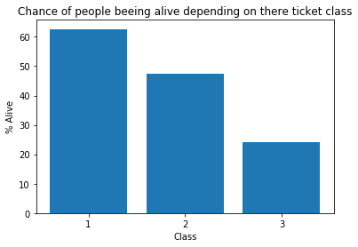

# Kaggle · Titanic

An early Python and machine learning project from 2018, predicting passenger survival in Kaggle's Titanic challenge. I explored the passenger data, encoded categorical features, then used **principal component analysis (PCA)** and an **RBF support vector machine** with scikit-learn. The recorded Kaggle score was **0.74641**.

*An original chart exploring survival rates by ticket class.*

Start with [FeatureEngineering.ipynb](FeatureEngineering.ipynb), then [PCA + SVM](PCA%2BSVM_result0.746.ipynb). Training/test CSVs and the original submission are included.

Preserved from my early days learning Python. The notebooks and their original analysis are unchanged and use older library APIs.
